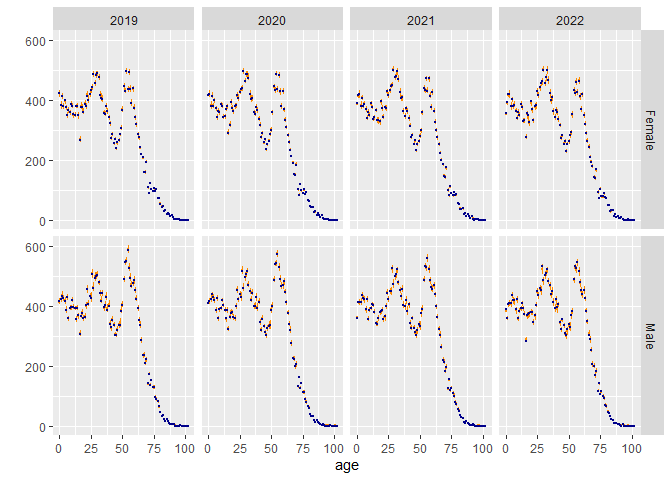
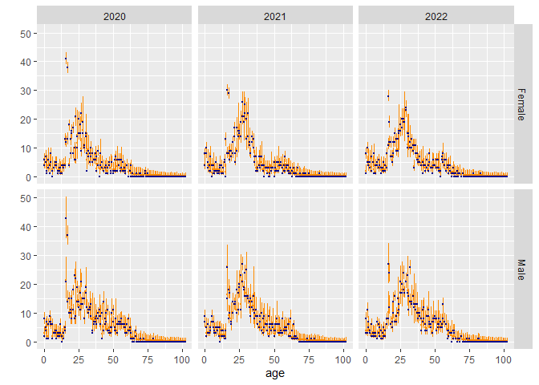
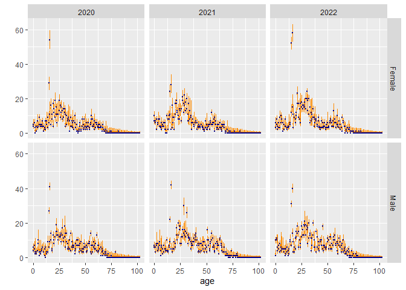
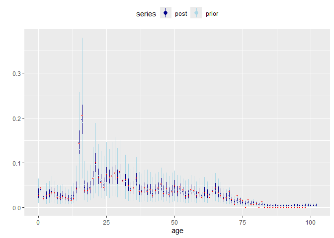
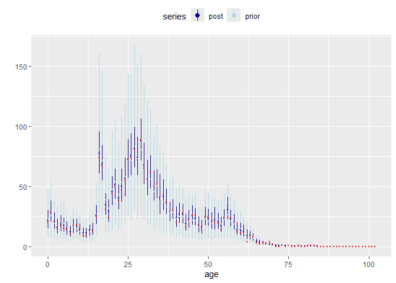

<!-- README.md is generated from README.Rmd. Please edit that file -->

# dpmaccount

<!-- badges: start -->

[](https://github.com/ONSdigital/dpmaccount/actions/workflows/R-CMD-check.yaml)

[](https://github.com/ONSdigital/dpmaccount/actions/workflows/style.yaml)

[](code_of_conduct.md)
<!-- badges: end -->

## Overview

The dpmaccount package provides a framework for estimating a demographic
account from multiple noisy datasets using template model builder (TMB).
The user specifies the ‘system models’ containing the underlying
demographic rates and counts, and the ‘data models’ describing the
assumed relationship between reported counts for population, births,
deaths, and migration (stocks & flows), and the true underlying counts.
Once the system and data models are specified, estimation is
straightforward using the `estimate_account()` function, with the
results held in an object of class `"dpmaccount_results"` containing all
the information needed to generate estimates of counts and rates.

## Contributor guidance

**To see the complete [contributor
guidance](https://github.com/ONSdigital/dpmaccount/blob/main/CONTRIBUTING.md)**

**In brief:** All modifications to this package must be made through
**Pull requests**, ideally linked to a specific GitHub **Issue**.

Pull requests must be reviewed by someone other than the requester, if
more than one individual was responsible for the requested changes the
reviewer must be someone other than the main contributor, ideally it
will be reviewed by someone entirely uninvolved with the particular
changes made.

Pull requests should have a suitable pull request review form attached,
with key notes/descriptions of changes made added by the requester and
if applicable additional notes on particular areas to focus the review
(syntax changes, key functional changes, documentational changes etc.)

## Getting started

### Installation

#### Install directly from GitHub

If you have linked your RStudio installation to GitHub you should be
able to install the package directly from GitHub using the
install_github method from the devtools package

``` r
# install.packages("devtools")
library(devtools)

devtools::install_github("ONSdigital/dpmaccount", build_vignettes = TRUE, INSTALL_opts = "--no-multiarch")
```

If you have not/are unable to link your RStudio installation to GitHub
(you may encounter a 404 error when attempting the previous approach)
you can also install the package in two alternative ways

#### Install locally from .zip

Download a copy of the package repository as a .zip file (option in
‘Code’, below Open with GitHub Desktop) and install using the
install_local method from the devtools package (replace the path with
the path to the .zip file download location)

``` r
# install.packages("devtools")
library(devtools)

devtools::install_local("C:/.../Downloads/dpmaccount-main.zip", build_vignettes = TRUE, INSTALL_opts = "--no-multiarch")
```

#### Install locally from cloned repository

Clone the repository (options in ‘Code’ to HTTPS/SSH paths) and build
the package using the build() method from the devtools package

``` r
# install.packages("devtools")
library(devtools)

dpmaccount_build <- devtools::build("~/put/the/package/path/here")

devtools::install_local(dpmaccount_build, build_vignettes = TRUE, INSTALL_opts = "--no-multiarch")
```

### Usage (example)

In this example, we illustrate the main features of **dpmaccount**,
using data from Statistics Greenland. (For more on the data, see the
online help for the datasets used below.) We specify and estimate a
model, and then inspect the results.

First, however, we load the required packages.

``` r
library(dpmaccount)
library(dplyr, warn.conflicts = FALSE)
library(tidyr)
library(ggplot2)
```

Next we specify the ‘system models’ containing the underlying
demographic rates and counts, starting with ‘births’

``` r
sysmod_births <- sysmod(
  mean = gl_sysmod_mean_births,
  disp = 0.2,
  nm_series = "births"
)
sysmod_births
#> System model : An object of class "dpmaccount_sysmod"
#> 
#> series: births 
#> 
#> mean:
#>       age            time           mean         
#>  Min.   :13.0   Min.   :2020   Min.   :0.001418  
#>  1st Qu.:21.0   1st Qu.:2020   1st Qu.:0.014143  
#>  Median :29.5   Median :2021   Median :0.062292  
#>  Mean   :29.5   Mean   :2021   Mean   :0.055413  
#>  3rd Qu.:38.0   3rd Qu.:2022   3rd Qu.:0.093653  
#>  Max.   :46.0   Max.   :2022   Max.   :0.110555  
#> 
#> disp: 0.2
```

The models for deaths, ins, and outs are similar.

``` r
sysmod_deaths <- sysmod(
  mean = gl_sysmod_mean_deaths,
  disp = 0.2,
  nm_series = "deaths"
)
sysmod_ins <- sysmod(
  mean = gl_sysmod_mean_immig,
  disp = 0.2,
  nm_series = "ins"
)
sysmod_outs <- sysmod(
  mean = gl_sysmod_mean_emig,
  disp = 0.2,
  nm_series = "outs"
)
```

We collect these models together into a named list

``` r
sysmods <- list(
  sysmod_births,
  sysmod_deaths,
  sysmod_ins,
  sysmod_outs
)
```

Next we specify data models describing the assumed relationship between
reported counts for population, births, deaths, and migration, and the
true underlying counts.

Births and deaths are a special case. We use an ‘exact’ data model,
which tells **dpmaccount** that we are treating the births and deaths
data as error-free.

``` r
datamod_births <- datamod_exact(
  data = gl_report_births,
  nm_series = "births"
)
datamod_deaths <- datamod_exact(
  data = gl_report_deaths,
  nm_series = "deaths"
)
```

For populations, ins, and outs, we use ‘normal’ data models

``` r
datamod_popn <- datamod_norm(
  data = gl_report_popn,
  sd = gl_cover_sd_popn,
  nm_series = "population"
)
datamod_popn
#> Normal data model : An object of class "dpmaccount_datamod_norm"
#> 
#> dataset: gl_report_popn 
#> series: population 
#> data:
#>       age          sex                 time          count       
#>  Min.   :  0   Length:824         Min.   :2019   Min.   :  0.00  
#>  1st Qu.: 25   Class :character   1st Qu.:2020   1st Qu.: 89.75  
#>  Median : 51   Mode  :character   Median :2020   Median :343.50  
#>  Mean   : 51                      Mean   :2020   Mean   :273.88  
#>  3rd Qu.: 77                      3rd Qu.:2021   3rd Qu.:410.00  
#>  Max.   :102                      Max.   :2022   Max.   :588.00  
#>      cohort    
#>  Min.   :1917  
#>  1st Qu.:1944  
#>  Median :1970  
#>  Mean   :1970  
#>  3rd Qu.:1995  
#>  Max.   :2022  
#> 
#> ratio: 1
#> 
#> sd:
#>       age             sex                  sd        
#>  Min.   :  0.00   Length:206         Min.   : 1.000  
#>  1st Qu.: 25.25   Class :character   1st Qu.: 4.247  
#>  Median : 51.00   Mode  :character   Median : 7.979  
#>  Mean   : 51.00                      Mean   : 7.613  
#>  3rd Qu.: 76.75                      3rd Qu.:10.669  
#>  Max.   :102.00                      Max.   :18.645  
#> 
#> scale_ratio: 0
#> 
#> scale_sd: 0
```

The data models for ins and outs are similar to the one for population,

``` r
datamod_ins <- datamod_norm(
  data = gl_report_immig,
  sd = gl_cover_sd_immig,
  nm_series = "ins"
)
datamod_outs <- datamod_norm(
  data = gl_report_emig,
  sd = gl_cover_sd_emig,
  nm_series = "outs"
)
```

We again collect the models into a named list.

``` r
datamods <- list(
  datamod_popn = datamod_popn,
  datamod_births = datamod_births,
  datamod_deaths = datamod_deaths,
  datamod_ins = datamod_ins,
  datamod_outs = datamod_outs
)
```

Once the system and data models are specified, estimation is
straightforward. For reproducibility, we also set a seed. Seeds are
stored in the results object and so, if required, must be set at this
stage.

``` r
results <- estimate_account(
  sysmods = sysmods,
  datamods = datamods,
  seed = 0
)
```

The output from `estimate_account()` is held in an object of class
`"dpmaccount_results"`.

``` r
results
#> Object of class "dpmaccount_results"
#> 
#>    --- system models ---
#> 
#>     births ~ Poisson(rate * exposure)
#>     deaths ~ Poisson(rate * exposure)
#>        ins ~ Poisson(rate)
#>       outs ~ Poisson(rate * exposure)
#> 
#>    --- data models ---
#> 
#> gl_report_popn ~ N(ratio * population, sd^2)
#> gl_report_immig ~ N(ratio * ins, sd^2)
#> gl_report_emig ~ N(ratio * outs, sd^2)
#> 
#>   Estimation succeeded in 212 out of 212 cohorts
```

Calling `summary()` on the results object produces an account with total
counts and rates.

``` r
summary(results)
#> Summary of object of class "dpmaccount_results"
#> 
#>  Estimation succeeded in 212 out of 212 cohorts
#> 
#>  --- population ---
#> 
#>   time population
#> 1 2019      56231
#> 2 2020      56525
#> 3 2021      56566
#> 4 2022      56463
#> 
#>  --- events ---
#> 
#>   time births deaths  ins outs
#> 1 2020    835    521 2090 2108
#> 2 2021    761    531 2127 2313
#> 3 2022    746    525 2196 2519
#> 
#>  --- rates ---
#> 
#>   time births  deaths  ins   outs
#> 1 2020 0.0148 0.00954 1990 0.0360
#> 2 2021 0.0135 0.00952 2040 0.0396
#> 3 2022 0.0132 0.00959 2100 0.0433
```

Function `diagnostics()` provides information on the performance of the
optimiser, and on any cohorts where the calculations failed.

``` r
diag <- diagnostics(results)
head(diag, 5)
#> # A tibble: 5 × 10
#>   cohort sex    nlminb_res nlminb_conv nlminb_msg       logpost var_nona var_pos
#>    <int> <chr>  <lgl>      <lgl>       <chr>              <dbl> <lgl>    <lgl>  
#> 1   1917 Female TRUE       TRUE        both X-converge…   -8.89 TRUE     TRUE   
#> 2   1917 Male   TRUE       TRUE        relative conver…   -8.91 TRUE     TRUE   
#> 3   1918 Female TRUE       TRUE        relative conver…  -25.0  TRUE     TRUE   
#> 4   1918 Male   TRUE       TRUE        relative conver…  -25.0  TRUE     TRUE   
#> 5   1919 Female TRUE       TRUE        relative conver…  -40.8  TRUE     TRUE   
#> # ℹ 2 more variables: var_nearpos <lgl>, success <lgl>
```

The model object `results` contains all the information we need to
generate estimates of counts and rates. Estimates can be obtained using
the `dpmaccount_results` method for generic function
`generics::components()`, however, for many purposes, the three
`augment` functions

- `augment_population()`
- `augment_events()`
- `augment_rates()`

are more convenient. All three functions are variants on the generic
function `generics::augment()`, which is part of the
[tidymodels](https://www.tidymodels.org) framework. Augment functions
contain the original dataset, augmented by columns with various types of
estimate.

`augment_population()`, for instance, gives the original population
data, combined with posterior draws for population counts
(`population`), posterior means (`population.fitted`) and lower and
upper limits for a 95% credible interval (`population.lower` and
`population.upper`).

``` r
res_population <- results %>%
  augment_population()
head(res_population, 5)
#> # A tibble: 5 × 9
#>   cohort sex     time   age gl_report_popn population    population.fitted
#>    <int> <chr>  <int> <int>          <dbl> <list>                    <dbl>
#> 1   1917 Female  2019   102              0 <dbl [1,000]>             1.23 
#> 2   1917 Male    2019   102              0 <dbl [1,000]>             1.16 
#> 3   1918 Female  2019   101              0 <dbl [1,000]>             0.882
#> 4   1918 Female  2020   102              0 <dbl [1,000]>             1.03 
#> 5   1918 Male    2019   101              0 <dbl [1,000]>             0.866
#> # ℹ 2 more variables: population.lower <dbl>, population.upper <dbl>
```

Having the raw data and the results together in the same data frame
makes it easy to construct plots that compare data and results.

``` r
ggplot(
  res_population,
  aes(
    x = age,
    ymin = population.lower,
    y = population.fitted,
    ymax = population.upper
  )
) +
  facet_grid(vars(sex), vars(time)) +
  geom_pointrange(
    fatten = 0.2,
    col = "darkorange"
  ) +
  geom_point(aes(y = gl_report_popn),
    col = "darkblue",
    size = 0.3
  ) +
  ylab("")
```



`components()`, `augment_population()`, `augment_events()`, and
`augment_rates()` all have a `collapse` argument that can be used to
collapse away age, sex, or cohort dimensions. To obtain population data
and estimates classified only by sex and time, for instance, we use

``` r
results %>%
  augment_population(collapse = c("age", "cohort"))
#> # A tibble: 8 × 7
#>   sex     time gl_report_popn population    population.fitted population.lower
#>   <chr>  <int>          <dbl> <list>                    <dbl>            <dbl>
#> 1 Female  2019          26530 <dbl [1,000]>            26575.           26499.
#> 2 Female  2020          26672 <dbl [1,000]>            26703.           26628.
#> 3 Female  2021          26759 <dbl [1,000]>            26766.           26687.
#> 4 Female  2022          26738 <dbl [1,000]>            26698.           26608.
#> 5 Male    2019          29551 <dbl [1,000]>            29656.           29562.
#> 6 Male    2020          29749 <dbl [1,000]>            29822.           29735.
#> 7 Male    2021          29803 <dbl [1,000]>            29801.           29712.
#> 8 Male    2022          29871 <dbl [1,000]>            29765.           29673.
#> # ℹ 1 more variable: population.upper <dbl>
```

Function `augment_events()` gives the original events (flows) data,
combined with posterior draws for immigration counts (`ins`), posterior
means (`ins.fitted`) and lower and upper limits for a 95% credible
interval (`ins.lower` and `ins.upper`), as well as the posterior draws
for emigration counts (`outs`), posterior means (`outs.fitted`) and
lower and upper limits for a 95% credible interval (`outs.lower` and
`outs.upper`)

``` r
res_events <- results %>%
  augment_events()
head(res_events, 5)
#> # A tibble: 5 × 18
#>   cohort sex     time   age gl_report_births gl_report_deaths gl_report_immig
#>    <int> <chr>  <int> <int>            <dbl>            <dbl>           <dbl>
#> 1   1917 Female  2020   102               NA                0               0
#> 2   1917 Male    2020   102               NA                0               0
#> 3   1918 Female  2020   101               NA                0               0
#> 4   1918 Female  2020   102               NA                0               0
#> 5   1918 Female  2021   102               NA                0               0
#> # ℹ 11 more variables: gl_report_emig <dbl>, births <dbl>, deaths <dbl>,
#> #   ins <list>, outs <list>, ins.fitted <dbl>, ins.lower <dbl>,
#> #   ins.upper <dbl>, outs.fitted <dbl>, outs.lower <dbl>, outs.upper <dbl>
```

Similarly to the population counts, it easy to construct plots that
compare data and results for the events, starting with immigration
(ins).

``` r
ggplot(
  res_events,
  aes(
    x = age,
    ymin = ins.lower,
    y = ins.fitted,
    ymax = ins.upper
  )
) +
  facet_grid(vars(sex), vars(time)) +
  geom_pointrange(
    fatten = 0.2,
    col = "darkorange"
  ) +
  geom_point(aes(y = gl_report_immig),
    col = "darkblue",
    size = 0.3
  ) +
  ylab("")
```



Also the emigration (outs)

``` r
ggplot(
  res_events,
  aes(
    x = age,
    ymin = outs.lower,
    y = outs.fitted,
    ymax = outs.upper
  )
) +
  facet_grid(vars(sex), vars(time)) +
  geom_pointrange(
    fatten = 0.2,
    col = "darkorange"
  ) +
  geom_point(aes(y = gl_report_emig),
    col = "darkblue",
    size = 0.3
  ) +
  ylab("")
```



Function `augment_rates()` returns a particularly rich set of results:

- variables starting with `direct` are ‘direct estimates’ of rates, that
  is, estimates formed by dividing observed event counts by observed
  exposures
- variables starting with `prior` describe prior distributions for
  rates, obtained by drawing from system models
- variables starting with `post` describe posterior distributions for
  rates, obtained via TMB

``` r
res_rates <- results %>%
  augment_rates(collapse = c("cohort", "sex"))
```

To illustrate some of the possibilities, we show emigration rates for
2022,

``` r
rates_emig <- res_rates %>%
  filter(time == 2022) %>%
  select(age, time,
    direct = direct.gl_report_emig,
    starts_with("prior.outs"),
    starts_with("post.outs")
  ) %>%
  select(!where(is.list)) %>%
  pivot_longer(
    cols = c(starts_with("prior"), starts_with("post")),
    names_to = c("series", "level"),
    names_pattern = "(.*)\\.outs\\.(.*)"
  ) %>%
  pivot_wider(names_from = level)
head(rates_emig, 5)
#> # A tibble: 5 × 7
#>     age  time direct series fitted   lower  upper
#>   <int> <int>  <dbl> <chr>   <dbl>   <dbl>  <dbl>
#> 1     0  2022 0.0267 prior  0.0318 0.00987 0.0646
#> 2     0  2022 0.0267 post   0.0302 0.0211  0.0401
#> 3     1  2022 0.0429 prior  0.0366 0.0132  0.0761
#> 4     1  2022 0.0429 post   0.0405 0.0301  0.0526
#> 5    10  2022 0.0206 prior  0.0220 0.00739 0.0450
```

``` r
ggplot(rates_emig, aes(x = age)) +
  geom_pointrange(
    aes(
      ymin = lower,
      y = fitted,
      ymax = upper,
      color = series
    ),
    fatten = 0.2
  ) +
  scale_color_manual(values = c(
    prior = "lightblue",
    post = "darkblue"
  )) +
  geom_point(aes(y = direct),
    col = "red",
    size = 0.3
  ) +
  ylab("") +
  theme(legend.position = "top")
#> Warning: Removed 8 rows containing missing values or values outside the scale range
#> (`geom_point()`).
```



And also immigration counts.

``` r
rates_immig <- res_rates %>%
  filter(time == 2022) %>%
  select(age, time,
    direct = direct.gl_report_immig,
    starts_with("prior.ins"),
    starts_with("post.ins")
  ) %>%
  select(!where(is.list)) %>%
  pivot_longer(
    cols = c(starts_with("prior"), starts_with("post")),
    names_to = c("series", "level"),
    names_pattern = "(.*)\\.ins\\.(.*)"
  ) %>%
  pivot_wider(names_from = level)
head(rates_immig, 5)
#> # A tibble: 5 × 7
#>     age  time direct series fitted lower upper
#>   <int> <int>  <dbl> <chr>   <dbl> <dbl> <dbl>
#> 1     0  2022     20 prior    23.3  7.27  45.2
#> 2     0  2022     20 post     22.2 15.4   29.1
#> 3     1  2022     29 prior    26.3  7.64  54.5
#> 4     1  2022     29 post     27.9 20.2   36.2
#> 5    10  2022     15 prior    12.4  4.31  25.6
```

``` r
ggplot(rates_immig, aes(x = age)) +
  geom_pointrange(
    aes(
      ymin = lower,
      y = fitted,
      ymax = upper,
      color = series
    ),
    fatten = 0.2
  ) +
  scale_color_manual(values = c(
    prior = "lightblue",
    post = "darkblue"
  )) +
  geom_point(aes(y = direct),
    col = "red",
    size = 0.3
  ) +
  ylab("") +
  theme(legend.position = "top")
```



## FAQs/Help

1.  There are missing values in the results of augmenting the
    population/events (augment_population(), augment_events(),
    augment_rates())
    - This typically occurs where cohorts have failed
    - The usual causes are inconsistencies in the input data
    - These failures can be mitigated through the use of the optional
      *scale_sd* and *scale_ratio* inputs to the data model functions
      (default - datamod_norm(…, scale_sd = 0, scale_ratio = 0))
    - The optional input to change depends on where the suspected
      consistencies are e.g. the stocks uncertainty (scale_sd - only
      available in datamod_norm()) or the coverage ratios (scale_ratio)
    - Setting these to be \> 0 can aid cohort failures (e.g. a value of
      0.05 is approximately equivalent to a 5% scaling).
2.  The account produced appears not to be consistent.

e.g. population_time_1 \< population_time_0 + births + in_migration -
deaths - out_migration

- There are typically two causes; rounding error in printed results,
  and/or extinct cohorts related to system model definitions.
- `summary(results)` rounds estimated values to the nearest integer and
  this occasionally leads to apparent inconsistencies. Instead, running
  `results |> augment_population()` and `results |> augment_events()`
  will give better precision in estimates.
- The data you provide for the system models defines the age range that
  estimates are created for. If the maximum age in your system model
  data is 105, while there could be people in the population aged
  greater than 105, `dpmaccount` will not produce estimates for ages
  greater than 105. Cohorts will only ever be estimated up to this
  maximum age.

## License

By contributing, you agree that your contributions will be licensed
under its [MIT License](http://choosealicense.com/licenses/mit/). For
additional information regarding the licensing, and related copyright,
of this code please refer to the
[LICENSE](https://github.com/ONSdigital/dpmaccount/blob/main/LICENSE.md)
